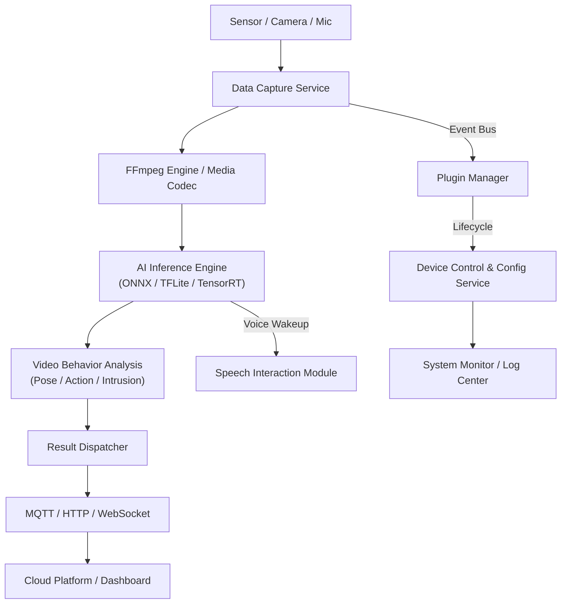

# Embedded AI Edge Gateway

> 一款融合音视频采集、AI 推理、行为分析、语音交互与边缘计算能力的智能嵌入式网关系统。

---

## 📘 项目概述

**Embedded AI Edge Gateway** 是一套运行在嵌入式 Linux / ARM 平台上的边缘智能系统，  
集成了音视频采集、AI 推理、行为分析、语音交互、远程管理与模块化框架设计。

系统支持多任务并行、模块动态加载、云端同步、设备间协作，  
可广泛应用于智能监控、工业边缘计算、语音识别终端、IoT 边缘节点等场景。

---

## 📁 项目目录结构

```bash
.
├── build/                    # 构建输出目录
├── config/                   # 配置文件
│   ├── plugins/
│   ├── speech/
│   └── system.yaml
├── docs/                     # 文档
├── include/                  # 公共头文件
├── models/                   # AI 模型文件
├── scripts/                  # 编译/运行脚本
├── src/                      # 源码
│   ├── capture/              # 视频/音频采集模块
│   ├── control/              # 设备控制模块
│   ├── core/                 # 核心模块：配置/日志/事件总线
│   ├── dispatcher/           # 结果分发模块
│   ├── inference/            # AI 推理模块
│   ├── main/                 # 主程序与 QML UI
│   ├── plugins/              # 插件管理模块
│   └── speech/               # 语音模块
└── tests/                    # 单元测试
```

---

> 更多详细模块架构说明，请参考 [docs/architecture.md](docs/architecture.md)

---

## 🧱 系统功能模块

| 模块                    | 说明                                    |
| --------------------- | ------------------------------------- |
| **Capture**           | 视频（V4L2、FFmpeg、OpenCV）与音频采集，帧缓存管理。 |
| **Inference**         | 多框架（ONNX、TFLite、TensorRT）AI 模型推理接口。 |
| **Behavior Analysis** | 行为识别（跌倒检测、打架识别、区域入侵检测等）。 |
| **Speech**            | 语音唤醒、语音识别与 TTS 合成。          |
| **Dispatcher**        | 将分析结果通过 MQTT/HTTP/WebSocket 推送。 |
| **Plugins**           | 动态模块管理系统，支持功能扩展与任务编排。 |
| **Core**              | 配置管理、日志系统、事件总线、系统控制等底层支撑。 |

---

## ⚙️ 系统架构图




---

## 🚀 编译与运行

```bash
# 编译
./scripts/build.sh

# 运行
./scripts/run.sh

```
---

## 🧩 后续扩展方向

YOLOv8 / OpenVINO / TensorRT 推理加速

多摄像头同步分析

行为分析报警逻辑优化

云端 AI 平台对接

安全沙箱机制与远程升级


